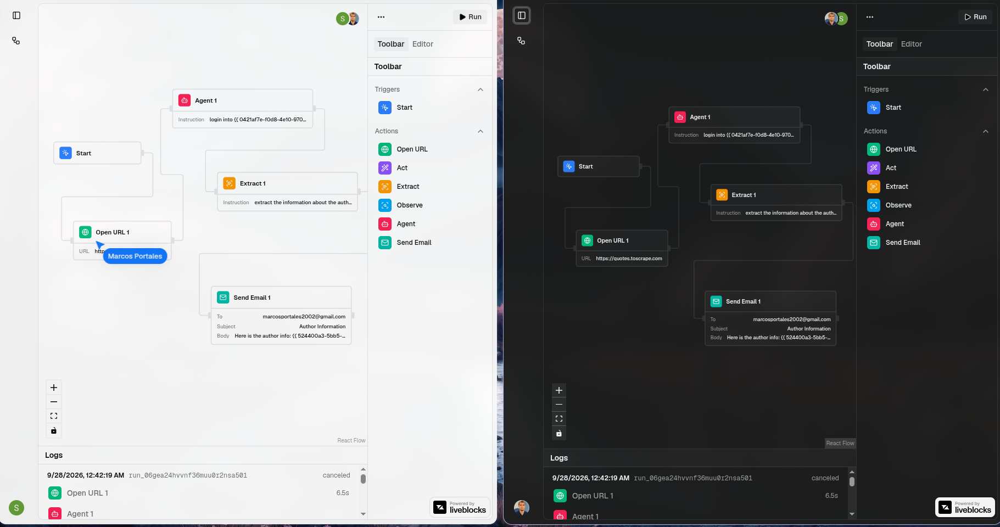

# Relay

Relay is a visual, multiplayer builder for AI browser automations. You drag
nodes onto a canvas, wire them together, and run the workflow. Each run happens
in a cloud browser, and you can watch the steps update live, check each step's
output, and replay a recording of the browser session.



- **Canvas editor.** Built on React Flow, with real-time collaboration
  (cursors, presence, shared graph) through Liveblocks.
- **AI browser steps.** Stagehand v4 `act`, `extract` and `observe` run on a
  Browserbase cloud browser.
- **Background execution.** Workflows run as a Trigger.dev task. Step status
  streams back to the canvas through run metadata.
- **Session replay.** The Browserbase HLS recording of a run is proxied
  server-side (Pro plan).
- **Organizations and billing.** Clerk handles auth, organizations and the
  `org:pro` plan.
- **Observability.** Sentry covers the Next.js app and the Trigger.dev tasks.

## Tech stack

| Area            | Tool                                                           |
| --------------- | -------------------------------------------------------------- |
| Framework       | Next.js 16 (App Router), React 19, TypeScript                  |
| UI              | Tailwind CSS v4, shadcn/ui, lucide-react                       |
| Canvas          | `@xyflow/react` (React Flow 12)                                |
| Collaboration   | Liveblocks (`@liveblocks/react-flow`)                          |
| Auth & billing  | Clerk (organizations, `org:pro` plan)                          |
| Database        | Neon Postgres + Drizzle ORM                                    |
| Background jobs | Trigger.dev v4                                                 |
| Browser / AI    | Browserbase + Stagehand v4 (`google/gemini-2.5-flash`)         |
| Email           | Resend                                                         |
| Monitoring      | Sentry (`@sentry/nextjs`, `@sentry/node` in tasks)             |

## Getting started

### Prerequisites

- Node.js 20+ (Trigger.dev tasks run on `node-24`)
- pnpm
- Accounts for Clerk, Neon (or any Postgres), Trigger.dev, Liveblocks,
  Browserbase, Resend and Sentry

### 1. Install

```bash
pnpm install
```

### 2. Environment variables

Create `.env.local` in the project root:

```bash
# Clerk
NEXT_PUBLIC_CLERK_PUBLISHABLE_KEY=
CLERK_SECRET_KEY=
NEXT_PUBLIC_CLERK_SIGN_IN_URL=/sign-in
NEXT_PUBLIC_CLERK_SIGN_UP_URL=/sign-up
NEXT_PUBLIC_CLERK_SIGN_IN_FALLBACK_REDIRECT_URL=/
NEXT_PUBLIC_CLERK_SIGN_UP_FALLBACK_REDIRECT_URL=/

# Database (Neon)
DATABASE_URL=            # pooled connection, used by the app
DATABASE_URL_UNPOOLED=   # direct connection, used by drizzle-kit migrations

# Trigger.dev
TRIGGER_SECRET_KEY=

# Liveblocks
NEXT_PUBLIC_LIVEBLOCKS_PUBLIC_KEY=
LIVEBLOCKS_SECRET_KEY=

# Browserbase
BROWSERBASE_API_KEY=
BROWSERBASE_PROJECT_ID=

# Resend
RESEND_API_KEY=

# Sentry
NEXT_PUBLIC_SENTRY_DSN=
SENTRY_DSN=
SENTRY_AUTH_TOKEN=       # source map upload (build / deploy only)
```

> The `run-workflow` task runs on Trigger.dev, not in Next.js. Add the
> variables it needs in the Trigger.dev dashboard for each environment:
> `DATABASE_URL`, `BROWSERBASE_API_KEY`, `BROWSERBASE_PROJECT_ID`,
> `RESEND_API_KEY` and `SENTRY_DSN`.

### 3. Database

The schema is in `lib/db/schema.ts`, and generated migrations go in `drizzle/`.

```bash
pnpm db:migrate     # apply migrations
pnpm db:generate    # generate a migration after changing the schema
pnpm db:push        # push the schema directly (prototyping)
pnpm db:studio      # browse data in Drizzle Studio
```

### 4. Third-party setup

- **Clerk:** turn on **Organizations**. In Billing, create an organization plan
  with the key `pro`. The code checks it with `has({ plan: "org:pro" })`.
  Users must pick an organization (`/choose-organization`) before they can use
  the dashboard.
- **Trigger.dev:** the project ref is in `trigger.config.ts`. Change it to your
  own project if you fork this repo.
- **Sentry:** the org and project slugs are in `next.config.ts` and
  `trigger.config.ts`.
- **Resend:** emails are sent from `onboarding@resend.dev`. Until you verify a
  domain, they are only delivered to your own Resend account address.

### 5. Run locally

You need two processes:

```bash
pnpm dev                       # Next.js at http://localhost:3000
npx trigger.dev@latest dev     # Trigger.dev dev worker (runs workflow tasks)
```

## Scripts

| Script             | Description                        |
| ------------------ | ---------------------------------- |
| `pnpm dev`         | Start the Next.js dev server       |
| `pnpm build`       | Production build                   |
| `pnpm start`       | Serve the production build         |
| `pnpm lint`        | ESLint                             |
| `pnpm typecheck`   | `tsc --noEmit`                     |
| `pnpm format`      | Prettier (with Tailwind plugin)    |
| `pnpm db:*`        | Drizzle Kit (see above)            |

## Project structure

```
app/
  (auth)/                   Clerk sign-in / sign-up pages
  (dashboard)/              Dashboard layout, workflow editor, pricing
  api/liveblocks/auth       Liveblocks ID-token auth (user + org)
  api/liveblocks/users      User info resolver for presence
  api/replays/[sessionId]   Server-side proxy for Browserbase HLS replays
  choose-organization/      Org picker
components/                 App sidebar, theme provider, shadcn/ui
features/
  init.ts                   Trigger.dev init (Sentry + failure reporting)
  workflows/
    actions.ts              Server actions: create/delete/run/cancel
    data.ts                 DB queries (scoped by org)
    components/             Canvas, step node, inspector, logs, replay…
    hooks/                  useProPlan, useUpstreamConnections
    lib/                    agent loop, {{ }} interpolation, graph validation
    nodes/                  Node registry + executors
    tasks/run-workflow.ts   Trigger.dev task that runs a workflow
lib/
  db/                       Drizzle client + schema
  browserbase.ts            Browserbase SDK client
  liveblocks.ts             Liveblocks node client
  resend.ts                 Resend client
design/                     UI reference screenshots
docs/                       README images
drizzle/                    Generated SQL migrations
proxy.ts                    Clerk middleware (Next.js 16 "proxy")
trigger.config.ts           Trigger.dev config
```

## How a workflow runs

1. The user clicks **Run**. `runWorkflowAction` checks the org, blocks premium
   nodes without the Pro plan, saves the graph to Postgres and triggers the
   `run-workflow` task, tagged `workflow:<id>`.
2. The task loads the graph, sorts the connected nodes topologically, and runs
   each node's executor in order. Nodes that aren't connected are skipped.
3. The first browser step starts a Browserbase session lazily, tagged with
   `userMetadata.orgId`, and creates a Stagehand instance. Workflows that never
   touch the browser never open one.
4. Step status (`pending → running → done | failed`), duration, output and
   error go into run metadata. The canvas subscribes to it through
   `@trigger.dev/react-hooks`.
5. When the run finishes, it returns `{ steps, sessionId }`. The replay route
   checks that the session belongs to the viewer's org, then serves the HLS
   playlist.

Runs can be stopped from the UI with `cancelWorkflowAction`, which only cancels
runs that belong to the caller's org.

### Referencing earlier outputs

Node fields can use earlier steps' outputs with `{{ nodeId.path }}`
placeholders. The placeholders are resolved just before the step runs (see
`features/workflows/lib/interpolate.ts`). Objects are inserted as JSON, and
missing values become empty strings.

### Available nodes

| Node        | Kind    | Fields                  | Outputs                              |
| ----------- | ------- | ----------------------- | ------------------------------------ |
| Start       | trigger | –                       | –                                    |
| Open URL    | action  | `url`                   | `url`, `title`                       |
| Act         | action  | `instruction`           | `success`, `message`, `url`          |
| Extract     | action  | `instruction`           | `result`                             |
| Observe     | action  | `instruction`           | `matches`                            |
| Agent (Pro) | action  | `instruction`           | `success`, `message`, `url`, `actions` |
| Send Email  | action  | `to`, `subject`, `body` | `id`                                 |

A workflow must have exactly one Start trigger and at least one edge, and it
can't contain cycles (`validate-graph.ts`).

The **Agent** node is a multi-step loop built from `extract` and `act`
(`features/workflows/lib/agent.ts`). Stagehand v4 has no built-in agent API,
so this replaces it.

## Adding a workflow node

Make three edits, all in `features/workflows/nodes/`:

1. **Impl file** (e.g. `open-url.ts`): the node's executor logic.
2. **`node-executors.ts`**: register the executor. The `satisfies` contract
   makes a missing executor a compile error for action nodes.
3. **`node-registry.ts`**: add the manifest entry: `kind`, `label`, `icon`,
   `accent`, input `fields`, `outputs` for downstream references, and
   optionally `premium`.

The run task and the canvas step node read everything from the registry, so
you don't need to change them.

## Plans

The Pro plan (`org:pro`) unlocks:

- the **Agent** node, checked server-side in `runWorkflowAction`
- **session replay**, checked in `/api/replays/[sessionId]`

In the client, `useProPlan()` only controls what the UI shows. Always enforce
the plan on the server.

## Deployment

- **App:** deploy to Vercel (or any Next.js host) with the environment
  variables above. `SENTRY_AUTH_TOKEN` enables source map upload.
- **Tasks:** `npx trigger.dev@latest deploy`. Stagehand is marked `external`
  in `trigger.config.ts`, because it loads files relative to its own module and
  can't be bundled. Sentry source maps are uploaded on deploy.

## Contributor notes

See `CLAUDE.md` / `AGENTS.md` for the conventions this project follows:

- This is Next.js 16. Check `node_modules/next/dist/docs/` before relying on
  older APIs. Middleware lives in `proxy.ts`.
- Take DB row types from the Drizzle schema (`$inferSelect`, `Pick`/`Omit`).
  Don't write them by hand.
- Give component props an interface named `<Component>Props`.
- Escape `'` and `"` in JSX text (`&apos;`, `&quot;`).
- Check the current React Flow and Trigger.dev docs (or the skills in
  `.agents/skills/`) before changing that code.
